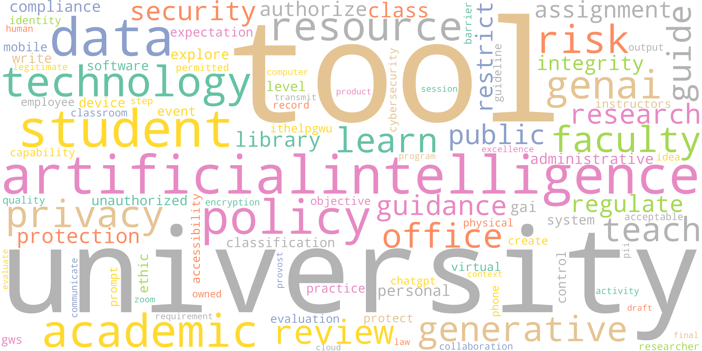
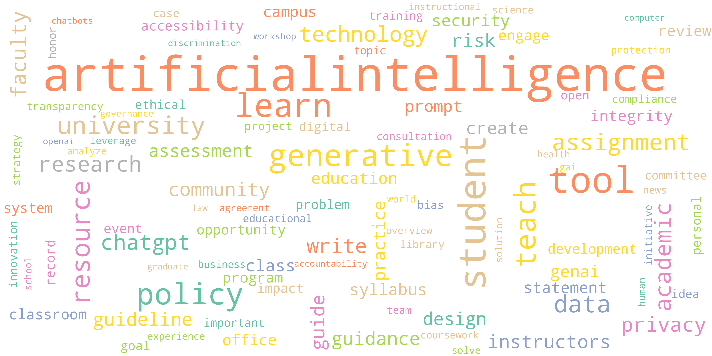
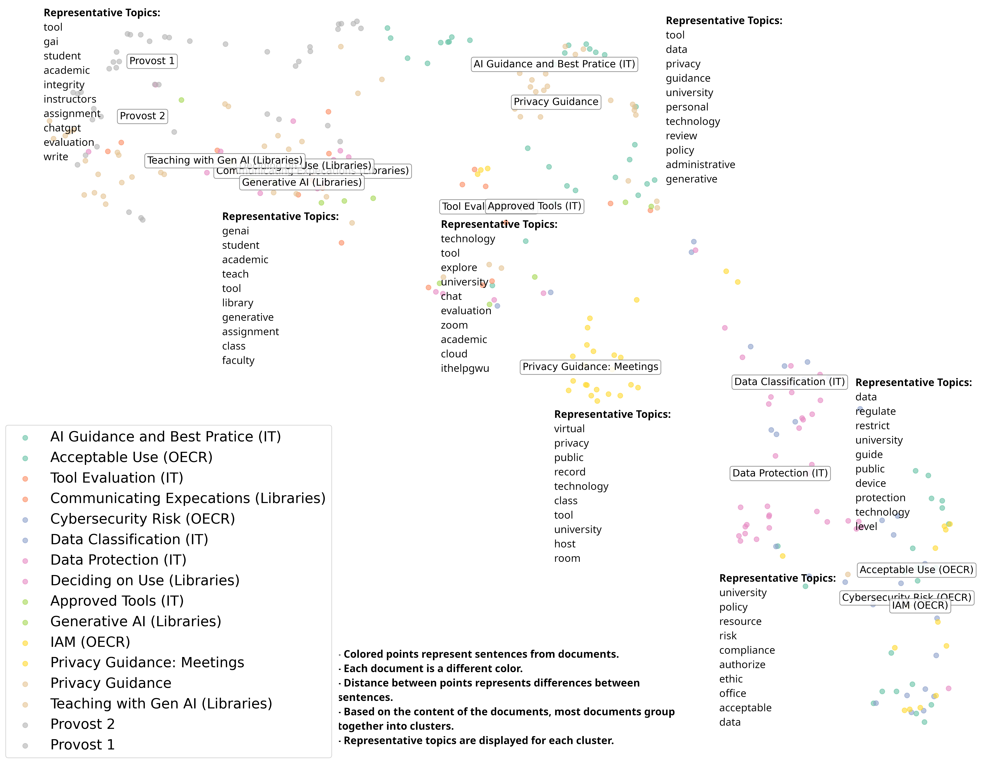
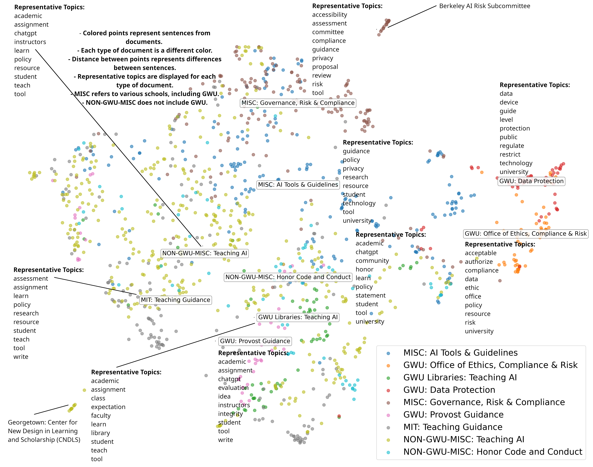

© 2025-26 Patrick Hall (jphall@gwu.edu). Some rights reserved. 

Text and copy are licensed under a [Creative Commons Attribution-NonCommercial-ShareAlike 4.0 International License (CC BY-NC-SA 4.0)](https://creativecommons.org/licenses/by-nc-sa/4.0/). You are free to share and adapt this material for noncommercial purposes, provided that you give appropriate credit, link to the license, indicate if changes were made, and distribute any contributions under the same license.

Software and scripts are licensed under an [MIT License](SOFTWARE_LICENSE).You are free to use, copy, modify, merge, publish, distribute, sublicense, and/or sell copies of this software, provided that the copyright notice and permission notice in the `SOFTWARE_LICENSE` file are included in all copies or substantial portions of the software.

## Contents

* [Presentations](#presentations)
* [Policies and Resources](#policies-and-resources)
* [Basic Human AI Teaming Guidance](#basic-human-ai-teaming-guidance)
* [Basics on Handling Cheating and Plagiarism](#basics-on-handling-cheating-and-plagiarism) 
* [Links](#links)
  * [GW School of Business AI Forum](#gw-school-of-business-ai-forum)
  * [GW School of Business *AI in Action Award*](#gw-school-of-business-ai-in-action-award)

## Presentations
* [GWSB Board of Advisors Update 1](gwu_caio_boa_1/GWU_CAIO_BoA_1.pdf) (December 2025)
* [Initial Policy Analysis](policy_analysis_1/Draft_Policy_Analysis_1.pdf) (January 2026)

## GW AI and IT Policy Analysis

### 1. Actionable Takeaways

#### Executive Summary — Actionable Takeaways for GWSB

- GW policies provide a solid base on which GWSB will build.
- GW guidance on approved tools, data, and classroom use should be socialized, e.g.,
  - [AI Tools and Services (Approved Tools List)](https://tinyurl.com/3zvh5b47)
  - [Data Classification Guidelines](https://it.gwu.edu/data-classification-guide)
  - [Generative Artificial Intelligence (GW Libraries)](https://library.gwu.edu/generative-ai)
- GW and external resources provide models for forthcoming GWSB
  [principles](https://ai.universityofcalifornia.edu/governance-transparency/),
  [policies](https://students.business.columbia.edu/office-of-student-affairs/academic-advising-and-student-success/academic-integrity/generative-ai-policy),
  [syllabus statements](https://provost.gwu.edu/sites/g/files/zaxdzs5926/files/2023-04/generative-artificial-intelligence-guidelines-april-2023.pdf),
  or [toolkits](https://sites.google.com/view/aiassignments).
- GWSB-specific policies may need to fill gaps related to approved tools, policy adherence and enforcement (e.g., AI-specific oversight, honor codes), responsible AI and AI safety, and clearer guidance for researchers.

### 2. GW AI and IT Policies

#### Existing Policies

- **AI and IT policies**
  - GW IT policies address best practices, approved tools, security, and data classification.
  - Libraries and Academic Innovation guidance provides teaching resources, including checklists and tools.
  - Office of Ethics, Compliance, and Risk policies address data privacy, digital identity, and responsible technology use.
  - Office of the Provost provides guidelines for academic work.
  - The Privacy Office provides in-depth privacy policies and guidance.
  - See Appendix A for links to GW policies.
- **Policy alignment and coverage**
  - Overall alignment and coverage is laudable.
  - Some details are becoming dated (e.g., references to unapproved ChatGPT).
  - See Section 4 for more detail on gaps and points of interest.
- See **interactive NotebookLM [tool](https://notebooklm.google.com/notebook/d6709e69-032a-427c-bc07-8f23bf19c184)** for AI-guided GW policy Q&A  
  *(GW Faculty and staff: click the hyperlinked “tool” to request access.)*

#### Summary of GW AI and IT Policies — Word Cloud

*Top keywords across GW AI and IT policies.*

### 3. External AI Policies

#### Summary of Considered External Policies

- Judgment-based sample of 12 large, prominent private and public universities (e.g., Ivy League and UC schools).
- Includes business schools (e.g., Columbia, Harvard, Stanford).
- Includes AI policies, AI resources, legal alerts, research guidance, staff guidance, and teaching guidance.
- See Appendix B for a complete listing of considered external policies.

#### Summary of Considered External AI Policies — Word Cloud

*Top keywords across external AI policies.*

### 4. Gaps and Points of Interest

#### Summary of Potential Gaps

- Relative to external resources, GW could bolster AI policies related to:
  - **AI governance processes and procedures**
    - Specific mechanisms for adherence and enforcement, defined leadership roles, and updates to codes of integrity.
  - **Approved tools**
    - GW-approved tools do not yet include AI APIs or agentic tools.
  - **Responsible AI and AI safety**
    - Guidance on high-risk use or misuse (e.g., nondiscrimination testing of hiring tools; malicious generation of NCII).
  - **AI use in research and knowledge generation**
    - See USC’s [Using Generative AI in Research](https://libguides.usc.edu/generative-AI/home) or Columbia’s
      [Generative AI Policy](https://provost.columbia.edu/content/office-senior-vice-provost/ai-policy).
- Many GW policies reference unapproved tools (e.g., ChatGPT, Claude); example syllabus statements may need updating.

#### Summary of Points of Interest

- **AI principles:** [UC System](https://ai.universityofcalifornia.edu/governance-transparency/)
- **AI policies:**  
  [Columbia](https://provost.columbia.edu/content/office-senior-vice-provost/ai-policy),
  [Columbia Business](https://students.business.columbia.edu/office-of-student-affairs/academic-advising-and-student-success/academic-integrity/generative-ai-policy),
  [Notre Dame](https://honorcode.nd.edu/generative-ai-policy-for-students-august-2023/),
  [UC Berkeley](https://oercs.berkeley.edu/appropriate-use-generative-ai-tools)
- **Syllabus statements:**  
  [Georgetown](https://cndls.georgetown.edu/resources/syllabus-policies/ai-and-homework-support/),
  [GW](https://provost.gwu.edu/sites/g/files/zaxdzs5926/files/2023-04/generative-artificial-intelligence-guidelines-april-2023.pdf),
  [Stanford Business](https://tlhub.stanford.edu/docs/course-policies-on-generative-ai-use/),
  [University of Washington](https://teaching.washington.edu/course-design/ai/sample-ai-syllabus-statements/)
- **Toolkits:**  
  [Classroom Expectations Worksheet (GW Libraries)](https://docs.google.com/document/d/1hQwgSR1Caksy7Rb2LRBhLEBugDLTsuMJVLTFLgDXxu8/edit),
  [Can I Use AI?](https://sites.google.com/view/aiassignments),
  [Georgetown CNDLS](https://cndls.georgetown.edu/resources/ai/),
  [MIT Teaching + Learning Lab](https://tll.mit.edu/teaching-resources/course-design/gen-ai-your-course/),
  [Student Checklist (GW Libraries)](https://docs.google.com/document/d/1Nutviqrix6NMb1XLM2N5nLe2Q1_7JHu5aTXlnSxKCh0/edit)
- **Topic model outliers**
  - [UC Berkeley AI Risk Subcommittee](https://oercs.berkeley.edu/CERC-AIR): enterprise risk and governance focus.
  - [Georgetown CNDLS](https://cndls.georgetown.edu/resources/ai/): holistic AI teaching toolkit.
- Track GW AI tool [evaluation status](https://it.gwu.edu/ai-tools-status).

### Appendices

#### A. GW Policy References

**Information Technology**
- [Data Classification Guidelines](https://it.gwu.edu/data-classification-guide)
- [Data Protection Guidelines](https://it.gwu.edu/data-protection-guide)
- [Generative Artificial Intelligence](https://it.gwu.edu/gen-ai)
  - [AI Guidance and Best Practices](https://it.gwu.edu/ai-guidance-and-best-practices)
  - [AI Tools and Services (Approved Tools List)](https://tinyurl.com/3zvh5b47)
  - [AI Evaluation and Status](https://it.gwu.edu/ai-tools-status)
  - [GW IT AI consultation form](https://gwu-myit.onbmc.com/dwp/rest/share/OJSXG33VOJRWKVDZOBST2U2CL5IVKRKTKREU6TSOIFEVERJGORSW4YLOOREWIPKBI5DUSQZTIZMECRKSIY3ECUSIGZGTSMCSJA3E2OJQGBIUURRGOJSXG33VOJRWKSLEHUYTCMZQGITGG33OORSXQ5CUPFYGKPKDIFKECTCPI5PUQT2NIU======) 

**Libraries and Academic Innovation**
- [Generative Artificial Intelligence (GenAI)](https://library.gwu.edu/generative-ai)
- [Communicating GenAI Expectations to Students](https://library.gwu.edu/communicating-your-genai-expectations-your-students)
- [Deciding on Appropriate Use of GenAI in Classes](https://library.gwu.edu/deciding-appropriate-use-genai-academic-classes)
- [Teaching with Generative AI](https://library.gwu.edu/teaching-generative-ai)

**Office of Ethics, Compliance, and Risk**
- [Acceptable Use of IT Resources Policy](https://compliance.gwu.edu/acceptable-use-it-resources-policy)
- [Cybersecurity Risk Policy](https://compliance.gwu.edu/cybersecurity-risk-policy)
- [Identity and Access Management Policy](https://compliance.gwu.edu/identity-and-access-management-policy)

**Office of the Provost**
- [Guidelines for Using GenAI in Academic Work](https://provost.gwu.edu/guidelines-using-generative-artificial-intelligence-connection-academic-work-0)
  - [GenAI Guidelines (PDF)](https://provost.gwu.edu/sites/g/files/zaxdzs5926/files/2023-04/generative-artificial-intelligence-guidelines-april-2023.pdf)
  - [Additional GenAI Guidance (PDF)](https://provost.gwu.edu/sites/g/files/zaxdzs5926/files/2023-08/additional_guidance_for_generative_ai_-_august_2023.pdf)

**Privacy Office**
- [Privacy Guidance for Use of AI](https://privacy.gwu.edu/privacy-guidance-use-artificial-intelligence)
- [Privacy Considerations for Virtual Platforms](https://privacy.gwu.edu/privacy-considerations-when-using-virtual-meeting-and-collaboration-platforms)

#### B. External Policy References

**Columbia University**
- [Columbia Business School: Generative AI Policy](https://students.business.columbia.edu/office-of-student-affairs/academic-advising-and-student-success/academic-integrity/generative-ai-policy)
- [AI Tools in the Classroom](https://ctl.columbia.edu/resources-and-technology/resources/ai-tools/)
- [Generative AI Policy](https://provost.columbia.edu/content/office-senior-vice-provost/ai-policy)

**Georgetown University**
- [AI and Homework Support Policies](https://cndls.georgetown.edu/resources/syllabus-policies/ai-and-homework-support/)
- [AI Resources](https://guides.library.georgetown.edu/ai)
- [AI Toolkit (CNDLS)](https://cndls.georgetown.edu/resources/ai/)

**Harvard University**
- [Harvard Business School (HBS): Using ChatGPT and AI Tools](https://www.hbs.edu/mba/handbook/standards-of-conduct/academic/Pages/chatgpt-and-ai.aspx)
- [Harvard Graduate School of Education (HGSE) AI Policy](https://registrar.gse.harvard.edu/AI-policy)
- [Guidelines for Using ChatGPT and Other Generative AI Tools](https://provost.harvard.edu/guidelines-using-chatgpt-and-other-generative-ai-tools-harvard)

**MIT**
- [Guidance for Use of Generative AI Tools](https://ist.mit.edu/ai-guidance)
- [Generative AI and Your Course](https://tll.mit.edu/teaching-resources/course-design/gen-ai-your-course/)

**Stanford University**
- [Stanford GSB: Course Policies on Generative AI Use](https://tlhub.stanford.edu/docs/course-policies-on-generative-ai-use/)
- [Artificial Intelligence Teaching Guide](https://teachingcommons.stanford.edu/teaching-guides/artificial-intelligence-teaching-guide)
- [Creating Your Course Policy on AI](https://teachingcommons.stanford.edu/teaching-guides/artificial-intelligence-teaching-guide/creating-your-course-policy-ai)
- [Generative AI Policy Guidance](https://communitystandards.stanford.edu/generative-ai-policy-guidance)
- [Responsible AI at Stanford](https://uit.stanford.edu/security/responsibleai)

**University of California (System)**
- [AI Governance and Transparency](https://ai.universityofcalifornia.edu/governance-transparency/)
- [Applicable Law and UC Policy](https://ai.universityofcalifornia.edu/governance-transparency/applicable-law-and-policy.html)
- [Legal Alert: Artificial Intelligence Tools](https://www.ucop.edu/ethics-compliance-audit-services/_files/compliance/ai/ai-alert.pdf)

**UC Berkeley**
- [AI at UC Berkeley](https://technology.berkeley.edu/AI)

**UC Irvine**
- [Generative AI for Teaching and Learning](https://dtei.uci.edu/generative-ai/)

**UCLA**
- [Artificial Intelligence (AI)](https://dts.ucla.edu/initiatives/ai)
- [Teaching Guidance for ChatGPT and Related AI Developments](https://senate.ucla.edu/news/teaching-guidance-chatgpt-and-related-ai-developments)

**University of Notre Dame**
- [AI Recommendations for Instructors](https://honorcode.nd.edu/ai-recommendations-for-instructors/)
- [AI@ND Policies and Guidelines](https://ai.nd.edu/policies-and-guidelines/)
- [Generative AI Policy for Students](https://honorcode.nd.edu/generative-ai-policy-for-students-august-2023/)

**USC**
- [Using Generative AI in Research](https://libguides.usc.edu/generative-AI/home)

**University of Washington**
- [AI+Teaching](https://teaching.washington.edu/course-design/ai/)
- [Sample AI Syllabus Statements](https://teaching.washington.edu/course-design/ai/sample-ai-syllabus-statements/)

**Yale University**
- [AI at Yale](https://ai.yale.edu/)
- [AI Guidelines](https://poorvucenter.yale.edu/AIguidance)
- [AI Guidelines for Staff](https://yaledata.yale.edu/yale-university-ai-guidelines-staff)
- [Guidelines for the Use of Generative AI Tools](https://provost.yale.edu/news/guidelines-use-generative-ai-tools)

#### C. Methodological References

This analysis combines qualitative review with topic modeling to surface structural similarities and gaps. Methodological references include:

- Lee, Daniel D., and H. Sebastian Seung. (1999). **Learning the Parts of Objects by Non-negative Matrix Factorization**. *Nature*, 401(6755), 788–791. https://www.nature.com/articles/44565.

- Lewis, Patrick, Ethan Perez, Aleksandra Piktus, *et al.* (2020). **Retrieval-augmented Generation for Knowledge-intensive NLP Tasks**. *Advances in Neural Information Processing Systems*, 33, 9459–9474. https://proceedings.neurips.cc/paper_files/paper/2020/file/6b493230205f780e1bc26945df7481e5-Paper.pdf.

- OpenAI. (2022). **New and Improved Embedding Model**. *OpenAI Blog*. https://openai.com/blog/new-and-improved-embedding-model.

#### D. Topic Model Clusters

##### Appendix D: Summary of GW AI and IT Policies — Visual Map of GW Policies

*Document clusters and their representative topics for GW AI and IT policies. Large image [available](policy_analysis_1/doc_clus_legend_annotated_crop.png).*

##### Appendix D: Summary of GW AI and IT Policies — Visual Map Takeaways

- **Teaching and Student Use (Provost + Libraries):** On the left, Provost and Libraries guidance form a large cluster focused on assignments, tools, integrity, expectations, and instructor–student communication. (Labels: `Provost 1` and `Provost 2`; `Teaching with Gen AI (Libraries)`, `Communicating Expectations (Libraries)`, `Generative AI (Libraries)`, and `Deciding on Use (Libraries)`.)
- **Library AI Toolkit:** Within that region, the Libraries’ AI pages cluster tightly together, providing toolkits that link AI to classes, assignments, faculty support, and concrete teaching strategies. (Labels: `Teaching with Gen AI (Libraries)`, `Communicating Expectations (Libraries)`, `Generative AI (Libraries)`, and `Deciding on Use (Libraries)`.)
- **IT AI Guidance, Privacy, and Meetings:** In the upper–central area, AI Guidance and Best Practice and the general Privacy Guidance documents connect AI use to data handling and personal-information protection, while a nearby Meetings cluster concentrates on virtual-meeting platforms. (Labels: `AI Guidance and Best Practice (IT)`, `Privacy Guidance: Meetings`, and `Privacy Guidance`.)
- **Tool Evaluation and Approved Tools:** Lower down, Tool Evaluation and Approved Tools form an operational cluster about evaluating, approving, and supporting specific tools (e.g., Zoom, chatbots) for academic use. (Labels: `Tool Evaluation (IT)` and `Approved Tools (IT)`.)
- **Baseline IT Risk and Data Governance:** On nearer right, Data Classification and Data Protection policies transition into Acceptable Use, Cybersecurity Risk, and IAM policies on the far right (Office of Ethics, Compliance, and Risk (OECR)), representing GW’s underlying data-governance and risk/compliance policies that AI-specific guidance builds upon. (Labels: `Data Classification (IT)` and `Data Protection (IT)`; `Acceptable Use (OECR)`, `Cybersecurity Risk (OECR)`, and `IAM (OECR)`.)

##### Appendix D: Summary of Considered External AI Policies — Visual Map of Policies

*Document clusters and their representative topics for external AI policies. Large image [available](policy_analysis_1/doc_clus_legend_annotated_crop_nongwu.png).*

##### Appendix D: Summary of Considered External AI Policies — Visual Map Takeaways

- **Governance Mechanisms:** On the upper and right sides of the map, Berkeley’s AI Risk Subcommittee and related compliance, cybersecurity, and data-protection documents (including some comparable GW risk/compliance policies) form a governance cluster that represents the most formal and centralized oversight of AI use. (Labels: `MISC: Governance, Risk, & Compliance`, `GWU Data Protection`, `GWU Office of Ethics, Compliance, & Risk`.)
- **AI Tools and Guidance:** AI guidance that focuses on tooling (including GW IT guidance) abuts the data protection and governance clusters in a central blob of documents. (Label: `MISC: AI Tools & Guidance`.)
- **Honor/Integrity Codes:** An honor code/conduct cluster captures many schools’ student-facing AI rules, while GW’s provost and library guidance sits nearby but separate, emphasizing teaching, evaluation, and support rather than misconduct and sanctions. (Labels: `NON-GWU-MISC: Honor Code and Conduct`, `GWU: Provost Guidance`.)
- **Teaching Guidance:** A left-side blob mixes less-actionable teaching and classroom guidance. (Label: `NON-GWU-MISC: Teaching AI`.)
- **Actionable Teaching Tools and Support:** At the teaching-oriented lower side, MIT, Georgetown CNDLS, and GW Libraries cluster around concrete assignments, assessment, and tools, with some overlap with GW Provost documents and CNDLS standing out as the most holistic toolkit. (Labels: `GWU Libraries: Teaching AI`, `GWU: Provost Guidance`, `MIT: Teaching Guidance`.)

## Basic Human AI Teaming Guidance

### Basic AI Usage Guidance

* **Don't let AI decide for you, instead ask AI for ...**
  * advice on options and you pick the best option combined with real-world knowledge.
  * feedback and improvements to your own ideas or decisions.
  * assistance with decision-making processes.
  * use statistical, machine learning, or optimization approaches as decision-support mechanisms.

* **Don't let AI answer a factual request for you, instead ...**
  * Search/research for the result yourself using a credible search engine (Kagi, Wayback Machine, Google Scholar) or libraries, books, indices, databases, or human experts.

* **Don't let AI write for you, instead ...**
  * You make the outline.
  * Ask AI to draft the outline into coherent text.
  * You proof and edit the result.
  * You add citations, figures, and tables, etc.

* **Don't trust AI to code for you, instead ...**
  * Have AI write the code and you write the tests and documentation.
  * You write the code and have AI write the tests and documentation.
  * Have AI write code the same approach in two ways and verify matching results.

* **Understand when to use other types of AI, use ...**
  * optimization, statistics and ML for data analysis and direct decision-making.
    * (generally, people are better at reasoning, and worse at statistics and calculation, relative to computer systems.) 
  * real-time sensor networks for real-time info (maps, weather, etc.).
  * credible search for factual information retrieval (Kagi, Wayback Machine, Google Scholar).

* **Understand how AI fails you by ...**
  * hallucinating/making up information.
  * generating fake citations.
  * combining true information incorrectly.
  * having poor knowledge in niche subjects.
  * failing at complex reasoning tasks.
  * misusing or exposing sensitive information.

* **Understand how you fail with AI by ...**
  * allowing AI results to confirm your pre-existing biases.
  * anthropomorphizing AI (ideas like "think," "understand," "reason," "feel" don't apply to AI ... AI systems memorize, calculate, and generate).
    * and worse, emotional entanglement. 
  * anchoring to AI results because they are the first information you see.
  * its sycophancy (allowing it to suck up to).
  * inputting sensitive information.
 
* **Understand how AI differs from human thinking, it ...**
  * lacks a model of the physical world.
  * lacks a model of its own information processing.
  * lacks emotion.
  * uses different sensory inputs (digital data, text, images, sound vs. smell, touch) 
  * can use massive memory.
  * can perform repetitive or boring cognitive tasks without attention problems.
 
### Basic AI Tool Guidance

* **Notebooks** (e.g., Jupyter / Colab)
  * *Use for:* quick experiments, data exploration, and early prototypes.
  * *Don’t use for:* producing finalized products.
  * While you can prototype a chatbot in a notebook (and even spin up a quick Gradio/Streamlit UI), you don’t usually deliver a final product as a notebook in the real world.

* **IDEs** (e.g., VS Code / PyCharm)
  * *Use for:* building final products and real applications (with folders, files, tests, Git, packaging, deployment, UIs, and users). This is the ideal kind of tool in which to build a chatbot or other finalized AI product.
  * *Optional:* Add a coding agent (e.g., Codex) in your IDE; it can read/modify code. IDEs and coding agents are professional-grade helper tools, not a final product themselves. 

* **Commercial apps/websites** (E.g., ChatGPT / Co-pilot / Gemini / NotebookLM)
  * *Use for:* exploring, drafting, brainstorming, coding help.
  * *Don’t use for:* final products. For final products, *do* use an IDE to build your own UI and backend code for calling APIs and other AI tools.
  * The ChatGPT website is its own UI. Don’t try to “wrap” that UI for a product--that's silly.  

* **Coding agents** (e.g., Codex)
  * *Use for:* generating code, fixing bugs, writing tests, etc.
  * *Don’t use for:* hosting or delivering a user-facing final product.
  * These help produce code for your app/product; they are not the app you deliver to end users. Don’t try to wrap coding agent UIs for your products--that's silly.

* **Language model APIs** (e.g., OpenAI API)
  * *Use for:* your app’s backend data processing—chat generation, retrieval, text-to-code, etc. You build your final product using APIs.
  * Language model APIs also mean the difficult computation occurs on **someone else's machine.**
  * Language model APIs are a general low-level tool for interacting with AI models within your own custom-built applications or products.

* **Websites, open-source models + tooling** (e.g., Hugging Face & `transformers` or `langchain` packages) 
  * *Use for:* loading and running open source models; your app’s backend data processing—chat generation, retrieval, text-to-code.
  * Open source models tend to run **on your own machine** (you will need better equipment, more memory, GPUs, etc.)
  * You can build a final product around/with Hugging Face models with or without commerical language model APIs.
  * *Don’t use for:* “wrapping” the Hugging Face website as your own product--that's silly.

* **Agentic tools** (e.g., Zapier, n8n)
  * *Use for:* building automated workflows for your own or small group use.
  * *Don't use for:* building a final product to sell to external users. Like ChatGPT and/or Codex, these are already finalized commerical products with their own UIs.
  * Mostly focused on software engineering automation, but can also perform some office tasks.  

* **Connectors** (e.g., MCP, ChatGPT Apps)
  * Use the model context protocol (MCP) to connect a language model API to various tools (databases, APIs, files, search, internal systems) in a programmatic way; MCP is typically used on the backend of apps or products. 
  * Use specific connecters (e.g., ChatGPT Apps) to let ChatGPT or other commerical apps connect to files, repos, messages, etc.; This enhances ChatGPT's abilities, and is not for building apps or products you surface to others. 

**Usage Rules of Thumb**:
  * *To learn and research for yourself*: Use chatbots (e.g., ChatGPT, NotebookLM). 
  * *To build a product for others to use:* Prototype/test/understand coding logic, API calls, and model usage in notebooks → Build a finalized chatbot or other AI app in an IDE, while letting coding agents help write code and build project infrastructure.
  * *To build an automated workflow for yourself:*
    * *Simple*: Use Zapier, n8n, etc., or ask a chatbot--you may get lucky. 
    * *Advanced*: Use a coding agent to write the software to complete the workflow.
  * Never input sensitive data.

*Disclosure:* I worked with AI to build these pointers.

### Tutorial: Chain-of-Thought Document Analysis Exercise with Spot-Checking 

This tutorial outlines a systematic workflow for extracting, verifying, and transforming document data into various educational and technical formats using an AI collaborator.

#### Extraction & Verification
The goal here is to pull raw data and ensure the AI remains grounded in the actual text.

##### 1. Raw Triplet Extraction
**Prompt:** 
> Hi, please read the attached document. Then extract 50 entity-attribute-relationship triplets from the attached document, each representing a key sentence or phrase. Please present the triplets in the order the sentences or phrases occur in the text. Present the triplets without headings or classifications.

*Note: Do not mention the name or specific topic of the document to keep the extraction objective.*

##### 2. Spot-Check Accuracy
Verify that the triplets aren't "hallucinations" by linking them back to source sentences.
**Prompts:**
> Thanks. Now I would like to check that these triplets accurately reflect the document. Please state the sentence or phrase from the document that the first triplet represents.
> 
> Thanks. Please state the sentence or phrase from the document that the 25th triplet represents.
> 
> Thanks. Please state the sentence or phrase from the document that the last triplet represents.

---

#### Thematic Organization
Moving from a chronological list to a structured knowledge hierarchy.

##### 3. Thematic Clustering
**Prompt:**
> Thanks. Now please perform a thematic clustering of the triplets. Present the cluster labels and the triplets that represent each cluster. Print each triplet with its original sequence number. Print the total number of triplets in each cluster.

*Check: Ensure triplets link back to their original sequence number, verify cluster subtotals, and confirm a total of 50 triplets.*

##### 4. Natural Language Conversion
Transforming rigid triplets into readable study notes.
**Prompt:**
> Thanks. Now reprint the cluster labels and the triplets, but please convert the triplets into plain English bullets or short sentences. Preserve the total number of bullets and the number in each cluster from the thematic clustering. Print the original sequence number of the triplet at the end of each bullet.

*Check: Ensure bullets link back to their original sequence number, verify cluster subtotals, and confirm a total of 50 bullets.*

---

#### Exporting to Technical Formats
Using the structured data to generate presentation and web assets.

##### 5. LaTeX Beamer Slide Deck
**Prompt:**
> Thanks. Now, please generate a short LaTeX Beamer slide deck from the cluster labels and the bullets. The cluster labels should become section headers and slide titles. Please preserve the numbering of the bullets, and ensure each cluster is represented in the slide deck and that the deck contains the correct total number of bullets.

##### 6. HTML Web Page
**Prompt:**
> Thanks. Now, please generate a basic HTML page from the cluster labels and the bullets. The cluster labels should become section headers. Please preserve the numbering of the bullets, and ensure each cluster is represented in the page and that the page contains the correct total number of bullets.

*Check: Ensure bullets link back to their original sequence number, verify cluster subtotals, and confirm a total of 50 bullets.*

---

#### Assessment
Creating tools for testing knowledge and visualizing relationships.

##### 7. Question Generation
**Prompt:**
> Thanks, now please use the entity and relationship aspects of the triplets to create 50 short answer questions. Please print the questions with their cluster labels. Preserve the total number of bullets and the number in each cluster from the thematic clustering. Print the original sequence number of the triplet at the end of each question.

##### 8. Creating the Answer Key
**Prompt:**
> Thanks, now please print each question with its corresponding answer bullet using the previously created summary bullets to create question/answer pairs. Preserve the total number of questions and answers and the number of pairs in each cluster from the thematic clustering. Print the original sequence number of the triplet at the end of each answer.

*Check: Ensure Q&A pairs link back to their original sequence number, verify cluster subtotals, and confirm a total of 50 Q&A pairs.*

---

#### Interactive Visualization
Generating technical summary visuals.

##### 9. Python Word Cloud (Colab)
**Prompt:**
> Thanks, now please show me the most straightforward Python code I can use in a Colab notebook to print a word cloud of the original 50 triplets. Please include all 50 triplets as a Python list of lists in the generated example code. Include the original sequence number as a comment after each individual list. Please include any necessary !pip install statements at the beginning of the code example.

*Check: Confirm triplets in Python match original triplets, test the Python code.*

##### 10. Visual Integration (Image Handling)
**Questions:**
> What is the easiest way to display the generated word cloud image from the Colab notebook into the LaTeX generated earlier?
>
> What is the easiest way to display the generated word cloud image from the Colab notebook into the HTML generated earlier?

##### 11. Mermaid Knowledge Graph
**Prompt:**
> Thanks, now please use the first cluster of triplets to create a knowledge graph in Mermaid. Please print the text that defines the Mermaid graph, and then separately provide instructions for how to view and download it. Retain the cluster label as the graph title and sequence number of the triplets as comments in Mermaid.

*Check: Confirm Mermaid triplets match the original first cluster triplets.*

## Basics on Handling Cheating and Plagiarism

### Have an AI policy in the class syllabus.
* Here are links to example syllabus policies from [Georgetown](https://cndls.georgetown.edu/resources/syllabus-policies/ai-and-homework-support/),
  [GW](https://provost.gwu.edu/sites/g/files/zaxdzs5926/files/2023-04/generative-artificial-intelligence-guidelines-april-2023.pdf),
  [Stanford Business](https://tlhub.stanford.edu/docs/course-policies-on-generative-ai-use/), and the
  [University of Washington](https://teaching.washington.edu/course-design/ai/sample-ai-syllabus-statements/).
* For assignment-specific guidelines, *see* [Can I Use AI?](https://sites.google.com/view/aiassignments) by Prof. Ryan Watkins, GW School of Education. 

### Understand default AI rules for GW. 
* A student submitting AI work as their own with no citation or disclosure is generally prohibited.
* *See* the [GenAI Guidelines (PDF)](https://provost.gwu.edu/sites/g/files/zaxdzs5926/files/2023-04/generative-artificial-intelligence-guidelines-april-2023.pdf) from the Office of the Provost, *Default Rules*.
* *See* most of GW's relevant [AI policies](https://github.com/jphall663/gwsb_caio?tab=readme-ov-file#a-gw-policy-references).

### There is no definitive way to understand whether someone used AI on a piece of work.
* GW Libraries [Teaching with Generative AI](https://library.gwu.edu/teaching-generative-ai) guidance suggests avoidance of AI detection tools. [Additional GenAI Guidance (PDF)](https://provost.gwu.edu/sites/g/files/zaxdzs5926/files/2023-08/additional_guidance_for_generative_ai_-_august_2023.pdf) from the Provost suggests we use our "human skills" to protect against plagiarism and cheating. 
* Strategies you might employ: 
  * Ask the student to explain the work. 
  * Compare the assignment in question to the student's past work or other students' work. 
  * Ask a [GW-approved](https://it.gwu.edu/explore-tools-services#tools-tab-3-name) chatbot to do the assignment and compare the output to the student's output.
  * Review with SafeAssign. 

## Links 

### GW School of Business AI Forum

* [Sign-up for the GWSB AI Forum](https://forms.gle/Qf67V5SF461fsrHp6)

### GW School of Business *AI in Action Award*

* [Read about the GWSB *AI in Action Award*](gwsb_ai_in_action_prize.md)
